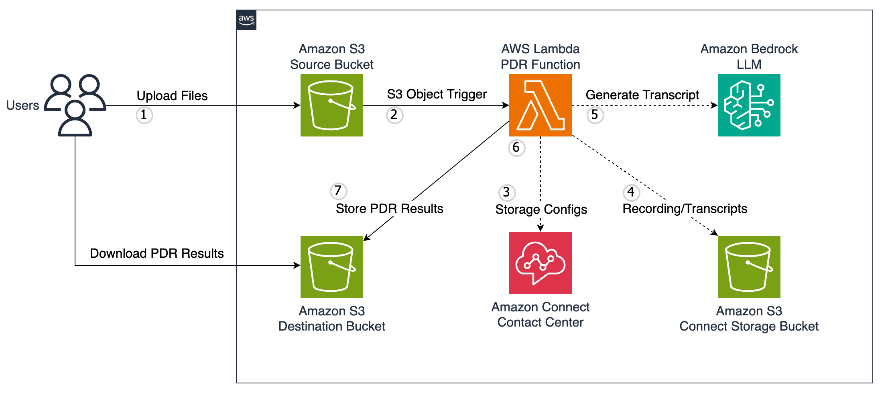

# Amazon Connect Public Disclosure Request Handler

This project demonstrates how to use Amazon Connect and Amazon Bedrock to automate the handling of public disclosure
requests (PDR) for contact center recordings and transcripts. The infrastructure is defined using AWS CDK with Java.

## Architecture



The solution uses the following AWS services:

- [Amazon Connect](https://docs.aws.amazon.com/connect/latest/adminguide/what-is-amazon-connect.html) - Contact center
  service
- [Amazon Bedrock](https://docs.aws.amazon.com/bedrock/latest/userguide/what-is-bedrock.html) - Foundation models for
  transcript processing
- [AWS Lambda](https://docs.aws.amazon.com/lambda/latest/dg/welcome.html) - Serverless compute for PDR processing
- [Amazon S3](https://docs.aws.amazon.com/AmazonS3/latest/userguide/Welcome.html) - Storage for recordings, transcripts,
  and PDR results
- [AWS CDK](https://docs.aws.amazon.com/cdk/v2/guide/home.html) - Infrastructure as code

## How It Works

1. Upload a CSV file with contact IDs to the source S3 bucket
2. Lambda function is triggered automatically
3. Lambda retrieves contact details from Amazon Connect
4. Lambda locates recordings and transcripts in the Connect storage buckets
5. For transcripts, Lambda uses Amazon Bedrock to convert JSON to human-readable format
6. Lambda generates presigned URLs for all files
7. Results are saved to the destination S3 bucket as a CSV file

## Deploy using AWS CDK

### Pre-requisites

Before getting started, make sure you have the following:

- AWS Account
- Amazon Connect instance configured with call recordings and chat transcripts
- Java Development Kit (JDK) installed on your local machine
    - Java 21 or later. If missing, install Amazon Corretto Java 21
      from [here](https://docs.aws.amazon.com/corretto/latest/corretto-21-ug/what-is-corretto-21.html).
      ```shell
      java --version
      ```
    - Maven 3.9 or later. If missing, install Maven from [here](https://maven.apache.org/download.cgi).
      ```shell
      mvn --version
      ```
- AWS CLI configured with valid credentials
    - AWS CLI. If missing, install latest AWS CLI
      from [here](https://docs.aws.amazon.com/cli/latest/userguide/install-cliv2.html).
      ```shell
      aws --version
      ```
- Node.js and npm installed (required for CDK)
    - Node.js 22.x or later. If missing, install Node.js from [here](https://nodejs.org/en/download/).
      ```shell
      node --version
      ```
- AWS CDK - Install the latest [AWS CDK Toolkit](https://docs.aws.amazon.com/cdk/v2/guide/cli.html) globally:
  ```shell
  npm install -g aws-cdk
  ```
  ```shell
  cdk --version
  ```
    - CDK Bootstrap - Bootstrap your AWS account for CDK (only needed once per account/region):
      ```shell
      cdk bootstrap aws://<account>/<region>
      ```

## Installation

Clone this repository and navigate to the project directory.

```shell
git clone <repository-url>
cd sample-amazon-connect-public-disclosure-request
```

## Build

Run the build command from the root directory of the project:

```shell
mvn clean install
```

## Deployment

Change to the Infra directory of the project:

```shell
cd Infra
```

## Configuration

Configure these values before deploying the infrastructure; Update the file [cdk.context.json](./Infra/cdk.context.json)
with your values.

```json
{
  "InstanceId": "<Amazon_Connect_Instance_Id>",
  "ConnectStorageBucket": "<S3_Bucket_Name_Connect>",
  "BedrockModelId": "anthropic.claude-3-5-sonnet-20241022-v2:0"
}
```

### Configuration Parameters

- **InstanceId**: Your Amazon Connect instance ID
- **ConnectStorageBucket**: The S3 bucket name where Amazon Connect stores recordings and transcripts
- **BedrockModelId**: The Bedrock foundation model ID to use for transcript processing (default: Claude 3.5 Sonnet v2)

### CDK deployment:

Run the following command to deploy the application:

```shell
cdk deploy
```

## Using the Solution

1. Create a CSV file with a list of contact IDs (one per line)

```csv
ContactIds
a34238e0-5cce-4006-a4f2-003d3c92842b
10875086-d73f-4436-9284-2c5796c32ff1
d2af70f1-cd4b-4387-a08c-d3b7dcf7d5b7
```

2. Upload the CSV file to the source S3 bucket created by the CDK stack
3. The Lambda function will process the request automatically
4. Check the destination S3 bucket for the results CSV file containing presigned URLs
    1. By default, Contact Ids related to both Chat/Voice will have one row for the transcripts.
    2. Contact Ids related to Voice will have one additional row for recordings.

```csv
ContactId,Channel,FileType,S3PreSignedURL
a34238e0-5cce-4006-a4f2-003d3c92842b,VOICE,TRANSCRIPT,https://...
a34238e0-5cce-4006-a4f2-003d3c92842b,VOICE,RECORDING,https://...
d2af70f1-cd4b-4387-a08c-d3b7dcf7d5b7,CHAT,TRANSCRIPT,https://...
10875086-d73f-4436-9284-2c5796c32ff1,VOICE,TRANSCRIPT,https://...
10875086-d73f-4436-9284-2c5796c32ff1,VOICE,RECORDING,https://...
```

## Processing Capacity and Error Handling

The Lambda function has a timeout setting of 10 minutes. The actual number of records that can be processed within this time depends on several factors:

- Size of the contact recordings and transcripts
- Response time of the Bedrock API calls
- Current load on the Connect API

On average, you can expect to process:
- Chat transcripts: ~60-80 records per 10-minute execution
- Voice contacts: ~30-50 records per 10-minute execution (due to larger file sizes)

If the function times out or encounters errors:

1. The function processes records sequentially from the input CSV
2. No automatic checkpoint/resume functionality is built in
3. To restart processing, upload a new CSV containing only the remaining unprocessed contact IDs
4. Check CloudWatch Logs to identify the last successfully processed contact ID

## Security

This solution includes several security features:

- S3 buckets are encrypted with KMS keys
- Public access to S3 buckets is blocked
- S3 server access logging is enabled
- IAM permissions follow least privilege principle
- Presigned URLs are used for secure file access

## Cleanup

Run the following command to delete all resources:

```shell
cdk destroy
```

This will remove all the provisioned resources from your AWS account.